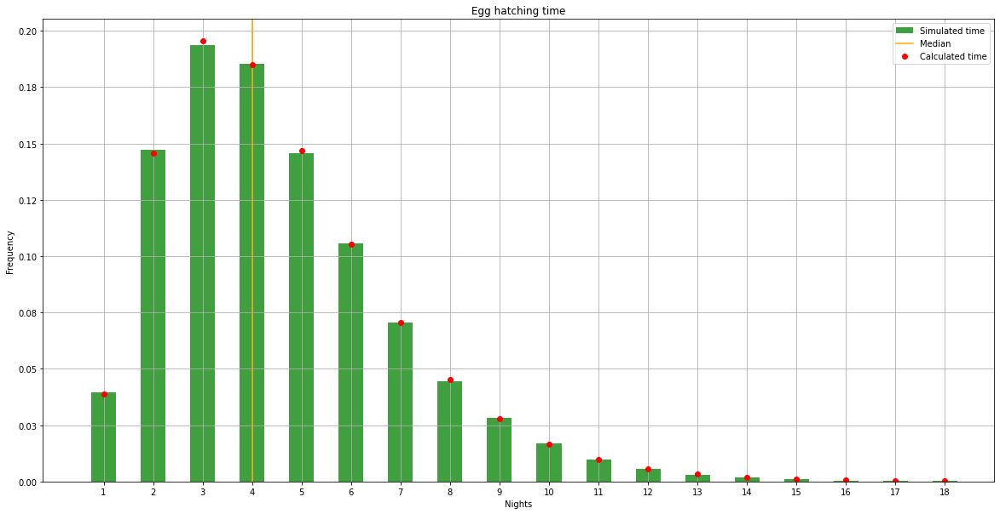

As of November 2020, the Minecraft wiki's documentation of mechanics relating to turtles and turtle
eggs. I have done some digging through the code to try to understand and document the mechanics
better.

Reference source code generated by [MCP-Reborn](https://github.com/Hexeption/MCP-Reborn) (1.16.3).

## Findings

Key:<br>
⬜️ Already documented but included in this document for completeness<br>
🔹 Partially documented on the wiki<br>
🟢 Undocumented on the wiki / new mechanic "discovery"<br>
⚠️ Possible bug / unintended behavior

Heartfelt note to Mojang: Please don't patch any bugs / unintended behavior :) Quirky mechanics can
make the game a pleasure to play and explore.

### Turtle Eggs
**Trampling**
- 🟢 Turtle eggs have a 1/100 chance per step of breaking while being walked on.
  [TurtleEggBlock.java:41]
- 🟢 Turtle eggs have a 1/3 chance of breaking when fallen onto from a block above by a living
  entity. Zombies can't break eggs by falling onto them. [TurtleEggBlock.java:47]
- ⬜️ When a multi-egg block is trampled, only one egg is broken. [TurtleEggBlock.java:58]
- 🟢 Turtle eggs can't be trampled by bats - bats are explicitly called out in the code. Possibly
  the result of a hilarious bug report? [TurtleEggBlock.java:148]
- 🔹 Turtle eggs can't be trampled by turtles. [TurtleEggBlock.java:148]
- 🟢⚠️ Despite special handling being added for bats, other flying mobs can technically trample
  eggs. I have confirmed this behavior in the case of bees.
- 🟢 Cats can trample eggs too, although it would seem that a cat would tread carefully over the
  delicate eggs.
- 🔹 Turtle eggs cannot be trampled by non-living entities such as arrows. [TurtleEggBlock.java:149]
- 🟢⚠️ When an anvil drops onto a turtle egg, the anvil breaks while the turtle egg is unharmed.


**Hatching mechanics**<br>
This was the big unknown I was trying to understand - there was little info on the timing of egg
cracking.
- ⬜️ Turtle eggs can only crack / hatch on sand. [TurtleEggBlock.java:105]
- 🟢 Turtle eggs have a chance of cracking during random ticks. Throughout the vast majority of the
  day, random ticks have a 1/500 chance of causing the egg to crack. There's a small window in the
  very early morning hours where random ticks have a 100% chance of cracking the eggs. This window
  is defined as the time between [celestial angles][1] `0.65` and `0.69`, or `03:36 am` and
  `04:33 am` on a 24-hour clock. This window lasts 48 seconds in-game. This is why eggs almost
  always hatch at night.
  ```
  3/4096 per tick chance of receiving a random tick
  24000 ticks in a day and 4% of those ticks get a 100% of cracking the egg
  1 / (24000 * 3/4096 * (0.96 * 1/500 + 0.04 * 1)) = 1.357 days per crack
  3 cracks required to hatch
  3 cracks * 1.357 days per crack = 4.07 days
  ```
  So on average a player can expect their egg to hatch in about 4 nights.
  [TurtleEggBlock.java:115-122]
  
  Simulation of hatching ~5,000 eggs:
  

  The median hatching time is 3 days and 70% of eggs hatch in 4 days. Nearly 90% of eggs hatch in 6
  days. Roughly 95% of hatching occurs during the 48-second window in the early morning hours.

**Miscellaneous**
- 🔹 Babies always hatch facing due south.
- 🔹 When a multi-egg block hatches, all eggs hatch simultaneously and babies are spawned at
  locations throughout the source block.
- ⬜️ Turtle eggs can be placed on any block even though they only hatch on sand. They can even be
  placed on non-solid blocks like fence posts, string, torches, or even more turtle eggs. Breaking
  blocks below eggs doesn't break them.

### Turtles
- 🔹 Baby turtles are actively sought out and hunted by drowneds, all variants of skeletons,
  zombies, ocelots, cats, foxes, and wolves.

**Mating**
- 🟢 Turtles have no data attributes regarding gender. When mating two turtles, one turtles is
  picked to lay the eggs.
  - This is possibly decided by which turtle the player clicks first.
- 🟢⚠️ According to the [MC Wiki][2], the male turtle can breed again immediately after mating
  while the pregnant turtle can't breed until after laying eggs. This is not actually the case.
  There's a bug that allows rapid infinite breeding between a single pair of turtles:
  - Mate 2 turtles on their home beech (so there's no travel time)
  - Try to mate the male again while the female is burying her eggs
  - Then the original male will begin laying eggs too (and even drop xp for succesfull breeding).

  Source of this behavior: After mating both turtle's "love" parameters are reset to 0 to exit love
  mode. However, when the female turtle starts digging in the sand to lay eggs, her love parameter
  is set back to 600 ticks (so there's a 30-second window to re-breed the two turtles).
  [TurtleEntity.java:438,477]
- 🔹 The pregnant turtle does not have to lay its eggs at its exact home beach coordinates - it can
  lay its eggs at a nearby sand block.

**Misc**
- 🔹 Turtles are instead insta-killed by lightning: Float.MAX_VALUE damage is dealt to the poor
  thing. Thor just yeets the turtle on sight. [TurtleEntity.java:311]
- Turtles can breathe underwater forever.

[1]: https://forums.minecraftforge.net/topic/30920-the-celestial-model-of-minecraft-including-daynight/
[2]: https://minecraft.gamepedia.com/Turtle#Breeding
